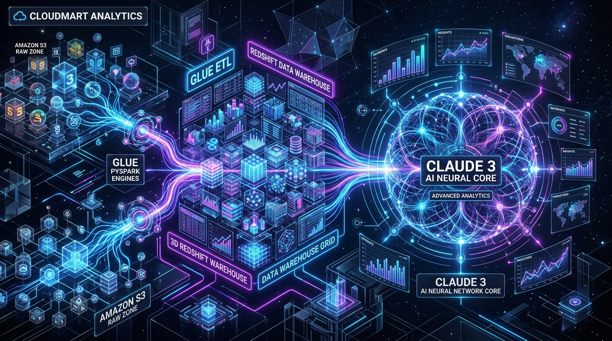
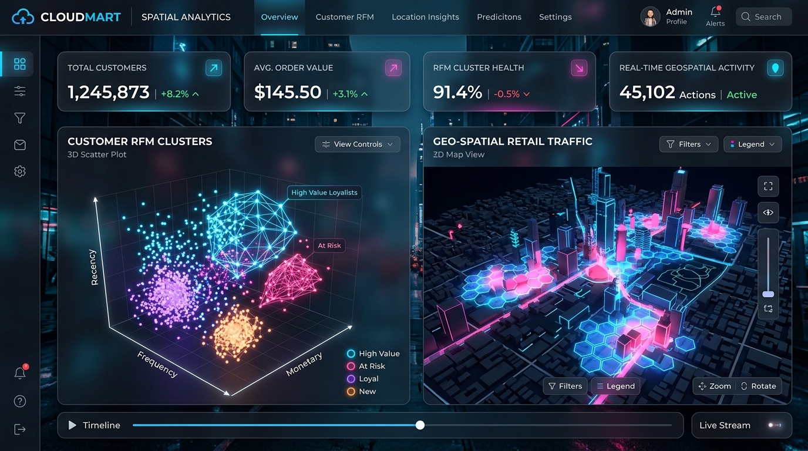
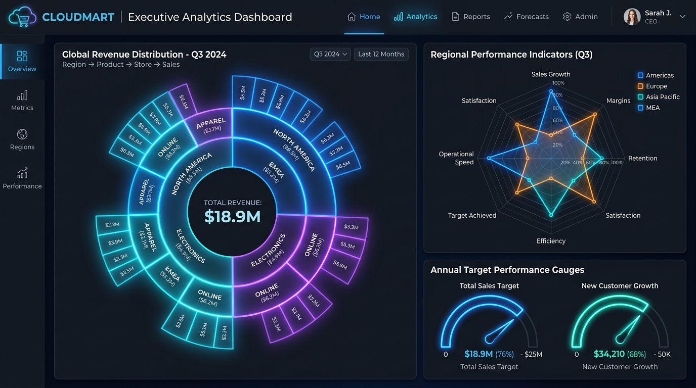
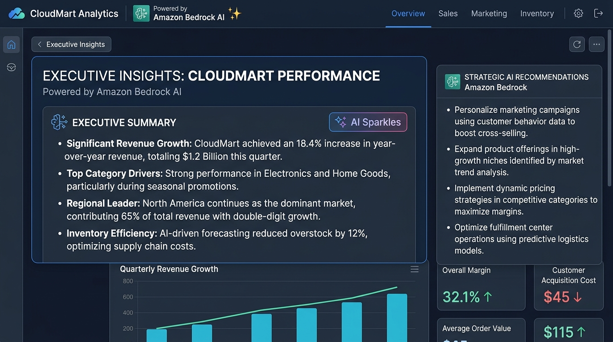

# CloudMart Analytics - End-to-End AWS Data Warehouse & GenAI Insights Pipeline

CloudMart Analytics is an enterprise-grade AWS data warehouse and generative AI insights pipeline for e-commerce sales analytics. It ingests batch file drops and simulated REST API streams into an AWS S3 Raw Zone, executes PySpark data cleaning, schema validation, and Slowly Changing Dimensions (SCD Type 2) tracking on AWS Glue, loads structured data into Amazon Redshift Serverless and Amazon Athena star schemas, and synthesizes natural-language executive summaries using Amazon Bedrock (Claude 3 / Titan foundation models). An interactive Streamlit dashboard presents real-time KPIs, historical trends, and automated AI insights for business decision-makers.

```mermaid
flowchart LR
    subgraph DataSources["Data Ingestion Layer"]
        A1["Batch Drops<br/>(CSV / JSON)"]
        A2["Simulated REST API<br/>(Orders Stream)"]
    end

    subgraph RawZone["AWS S3 Raw Zone"]
        B1[("s3://cloudmart-raw/<br/>orders, customers, products")]
    end

    subgraph ETL["AWS Glue PySpark Engine"]
        C1["Data Quality Checks<br/>(Nulls, Schema, Duplicates)"]
        C2["Transform & Clean<br/>(Currency, Standardize)"]
        C3["SCD Type 2 Engine<br/>(Customer & Product Dims)"]
    end

    subgraph CuratedZone["AWS Data Storage & Warehouse"]
        D1[("s3://cloudmart-curated/<br/>Parquet Lake")]
        D2[("Amazon Redshift<br/>Star Schema Warehouse")]
    end

    subgraph Analytics["Analytics & Intelligence Layer"]
        E1["Amazon Athena<br/>Ad-hoc SQL Queries"]
        E2["Amazon Bedrock<br/>Claude / Titan LLM"]
    end

    subgraph Consumption["Presentation Layer"]
        F1["Streamlit Executive Dashboard<br/>(Interactive Visuals & AI Insights)"]
    end

    DataSources --> RawZone
    RawZone --> ETL
    ETL --> CuratedZone
    CuratedZone --> Analytics
    Analytics --> Consumption
```



---

## 🛠️ Tech Stack

| Component | Technology | Description |
| :--- | :--- | :--- |
| **Cloud Provider** | AWS (Amazon Web Services) | Enterprise cloud ecosystem |
| **Storage / Data Lake** | AWS S3 (Raw & Curated Zones) | S3 buckets with encryption & 30/90-day lifecycle transitions |
| **ETL & Processing** | PySpark on AWS Glue 4.0 | Distributed PySpark data transformations & SCD Type 2 engine |
| **Data Warehouse** | Amazon Redshift Serverless | High-performance star-schema warehouse with column distribution |
| **Query Engine** | Amazon Athena | Interactive SQL query engine over S3 Parquet lakehouse data |
| **Generative AI** | Amazon Bedrock (Claude 3 / Titan) | Automated natural-language executive insight generation |
| **Infrastructure as Code** | Terraform (HCL) | Modular IaC for automated, reproducible cloud deployment |
| **Interactive Dashboard** | Streamlit + Plotly | Lightweight, responsive executive web app |
| **Testing & Quality** | PyTest + Ruff | Local Spark unit tests, schema validation, and PEP8 linting |
| **CI/CD** | GitHub Actions | Automated linting and test execution on every commit |

---

## 🚀 Live Demo

### Deploy & Launch in 1 Click on Streamlit Community Cloud

Click below to deploy and launch your live dashboard instantly on Streamlit Community Cloud (free hosting, zero setup required):

[](https://share.streamlit.io/deploy?repository=Raj-Dwivedi2005/cloudmart-analytics&branch=main&mainModule=dashboard/app.py)

👉 **[Deploy / Launch Live Streamlit Dashboard](https://share.streamlit.io/deploy?repository=Raj-Dwivedi2005/cloudmart-analytics&branch=main&mainModule=dashboard/app.py)**

*(Note: The live Streamlit app runs off the static Parquet snapshot generated by the pipeline, with an offline Bedrock fallback requiring zero active AWS billable endpoints to view!)*

---

## 📸 Screenshots & 3D Visualizations

### 1. Enterprise 3D Data Architecture & Cybernetic Core


### 2. 3D Spatial Analytics & RFM Customer Clusters


### 3. Multi-Dimensional Portfolio Analytics, Sunburst & Radar Performance


### 4. Amazon Bedrock Generative AI Executive Intelligence


---

## 🔍 How It Works

### Ingestion Layer
Raw sales transactions, customer profile changes, and product updates arrive via batch file drops (CSV/JSON) and a simulated REST API stream (`etl/extract/api_puller.py`). Files are deposited directly into the S3 Raw Landing Zone with SSE-S3 AES256 encryption.

### Transformation & SCD Engine
AWS Glue PySpark jobs execute modular transformation scripts (`etl/transform/clean_sales.py`). Data Quality assertions (`etl/common/data_quality.py`) enforce non-empty rules, schema validation, zero duplicate keys, and null thresholds. The SCD Type 2 module (`etl/transform/scd_handler.py`) tracks historical changes to customer demographics and product pricing using effective dates (`effective_date`, `end_date`) and active status flags (`is_current`).

### Data Lakehouse & Star Schema Warehouse
Transformed clean datasets are written to the S3 Curated Zone in columnar Parquet format and loaded into Amazon Redshift Serverless (`sql/ddl/create_star_schema.sql`). The star schema comprises one central fact table (`fact_sales`) and four dimension tables (`dim_customer`, `dim_product`, `dim_date`, `dim_region`).

### Amazon Bedrock GenAI Intelligence
The GenAI layer (`genai/bedrock_insights.py`) interfaces with Amazon Bedrock via `boto3` using foundation models such as `anthropic.claude-3-haiku-20240307-v1:0` or `amazon.titan-text-express-v1`. It processes aggregated SQL warehouse metrics to generate bulleted executive trend summaries and actionable recommendations.

### Executive Presentation Layer
A lightweight Streamlit web application (`dashboard/app.py`) presents interactive KPI metrics, monthly revenue trend lines, product SKU breakdowns, and regional performance charts. Users can trigger live AI executive summaries on demand.

---

## 💻 Local Setup & Development

### 1. Prerequisites
- Python 3.10+
- Java 11 (Required for PySpark local execution)
- Git

### 2. Clone & Install Dependencies
```bash
git clone https://github.com/Raj-Dwivedi2005/cloudmart-analytics.git
cd cloudmart-analytics

python -m venv venv
source venv/bin/activate  # On Windows: venv\Scripts\activate
pip install -r requirements.txt
```

### 3. Generate Synthetic Sample Data
```bash
python scripts/generate_sample_data.py
```

### 4. Run PyTest Unit Tests
```bash
pytest tests/ -v
```

### 5. Launch Local Streamlit Dashboard
```bash
streamlit run dashboard/app.py
```

---

## ☁️ Infrastructure Deployment (Terraform)

To deploy the entire AWS cloud infrastructure to your own AWS account:

```bash
cd infra

# 1. Initialize Terraform
terraform init

# 2. Plan Infrastructure Deployment
terraform plan

# 3. Apply Configuration
terraform apply -auto-approve
```

---

## 💰 Cost & Teardown Notes

### Approximate AWS Running Costs
- **AWS S3**: < $0.50/month (standard storage with 30-day IA lifecycle transition).
- **AWS Glue**: $0.44 per DPU-Hour (jobs run on demand, taking ~2-3 minutes).
- **Amazon Redshift Serverless**: $0.375 per RPU-Hour (automatically pauses when inactive).
- **Amazon Bedrock**: ~$0.00025 per 1,000 input tokens / $0.00125 per 1,000 output tokens.

### Complete Infrastructure Teardown
To avoid any ongoing cloud charges after testing, run:

```bash
cd infra
terraform destroy -auto-approve
```

---

## 🔮 Future Improvements

1. **dbt Integration**: Introduce dbt (data build tool) for managing modular SQL transformations and lineage testing inside Redshift.
2. **Streaming Ingestion**: Upgrade API ingestion from micro-batches to continuous streaming using AWS Kinesis Data Streams and Glue Streaming.
3. **Automated Data Quality Alerts**: Integrate AWS Deequ and SNS notifications for immediate Slack alerts on schema anomalies.
4. **Enhanced Bedrock Prompt Engineering**: Expand Bedrock prompts to support multi-turn conversational q&a over warehouse metrics.
